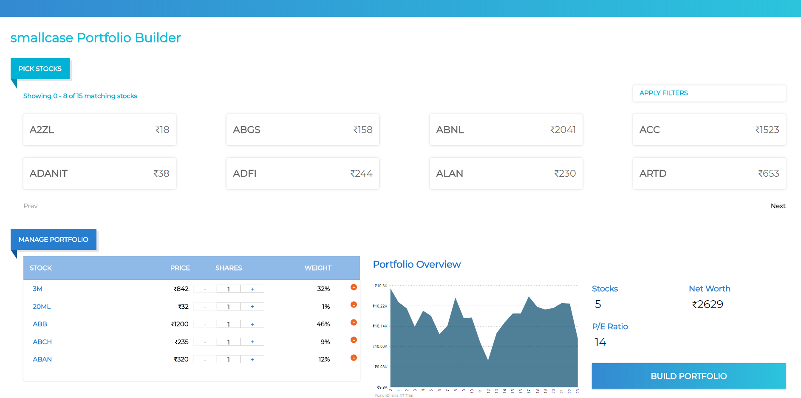

# Smallcase portfolio Builder

Hosted at https://portfolio-builder.netlify.com/



## Dev setup

### To set up the environment dependencies

```
$ npm install
```

### To run the react app (frontend)

```
$ npm run start
```
Client app is served on port `3000`

## Deployment steps

### To run the react app (frontend)

```
$ npm run build
```
Serve the `build` folder using any static server.
